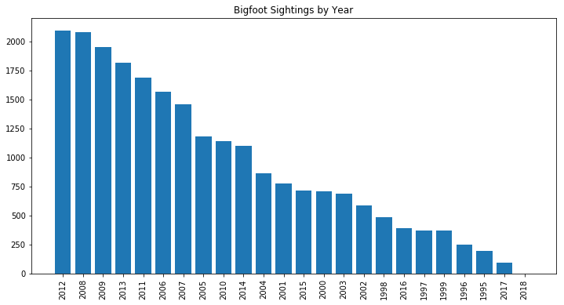
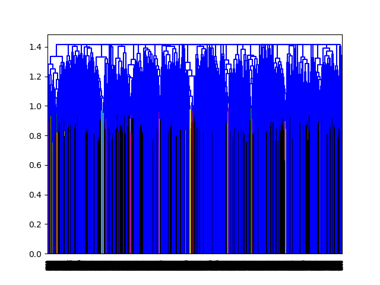
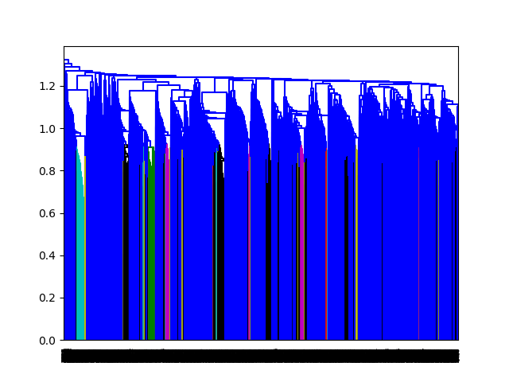

# An analysis of 'Squatchin' Reports
## Unsupervised Learning Case Study


### Data

The data contained Bigfoot sighting reports that were collected from the [Geographic Database of Bigfoot / Sasquatch Sightings & Reports](http://www.bfro.net/gdb/).

### Goals
* Obtain the data from the reporting website and transform it into a usable form
* Use unsupervised learning to reveal interesting information about Bigfoot sightings

### Web Scraping

The data was read in as a .json file and was transformed into a list, where
each element contained the content of each report:

```python
def get_content():
    reports = []
    with open('bigfoot_data.json') as f:
        for i in f:
            reports.append(json.loads(i))


    content_list = []
    data = pd.read_json('bigfoot_data.json', lines='true',orient='records')
    for i in range(len(reports)):
        soup = BeautifulSoup(reports[i]['html'], 'html.parser')

        tables = pd.read_html(data.iloc[i,1])
        content = tables[3][0][0]
        content = unidecode(content)
        content_list.append(content)
    return content_list
```

After web-scraping, an NLP analysis was conducted on the dataset (report content)
in order to make an attempt at clustering data, and revealing any latent features

### Findings
#### What state has the most Bigfoot sightings?


#### What season is Bigfoot most often seen?


#### How often is Bigfoot seen every year?




### Clustering Attempts

#### Top Words: Kmeans

(A Porter stemmer was used to tokenize content first)

No Cluster limit set

| Cluster     |        |   |   |   |   |   |   |   |   |
| -------    |:---------:| -----:| -----:| -----:| -----:| -----:| -----:| -----:| -----:|
|1| sound| sounds| lake| scream| howl| loud| night| vocalizations| expedition| sounded |
|2| tracks| prints| snow| track| print| found| inches| foot| footprints| trail |
|3| creature| sighting| car| driving| highway| hair| side| tall| feet| said|
|4| florida| expedition| north| creature| michigan| georgia| woods| investigator| 2009| 2013 |
|5| house| window| woods| back| night| dogs| one| around| said| door |
|6| stan| courtney| illinois| see| collected| giving| audio| special| recording| com|
|7| river| back| could| tree| see| us| one| would| woods| said |
|8| camp| tent| night| lake| camping| us| around| fire| back| sound|


5 Cluster Limit


| Cluster     |        |   |   |   |   |   |   |   |   |   
| -------    |:---------:| -----:| -----:| -----:| -----:| -----:| -----:| -----:| -----:|
|1| tracks| prints| snow| track| print| found| inches| footprints| foot| trail |
|2| stan| courtney| illinois| see| collected| giving| audio| special| recording | com |
|3| florida| expedition| michigan| 2013| 2012| creature| north| investigator| woods| expeditions|
|4| sound| night| lake| camp| sounds| tent| one| us| back| loud|
|5| creature| back| sighting| said| see| one| feet| around| could| hair|


[For more information on Squatchin: The one and only Stan Courtney](http://stancourtney.com/)

#### Top Words Per Topic: NMF


| Cluster     |        |   |   |   |   |   |   |   |   |  |
| -------    |:---------:| -----:| -----:| -----:| -----:| -----:| -----:| -----:| -----:|
|1| back | one |see |time |around| feet| got |looked |us| |something |
|2 |heard |sound |night |area |sounds |time |woods |around |loud |camp|
|3| witness |animal|investigator|sighting|creature|woods|feet|hair|area|witnesses|
| 4| road|creature|side|sighting|car|county|time|area|sightings|driving |
| 5| area|tracks|found|large|trail|one|deer|creek|tree|lake|

After each attempt at rendering clusters, we continually added to our list
of stop words that were utilized in the NLP, vectorization process. Common,
non-descriptive words were added to the last and the vectorization was re-run
to try and improve clustering results.

### Hierarchal Clustering

With little luck using Kmeans and NMF, we attempted to use hierarchal clustering
to see if there is literally any way to cluster report content (following NLP)

##### Hierarchal clustering, complete linkage



##### Hierarchal clustering, average linkage


### Future Work

- Develop more effective ways to split pertinent data out of HTML sources
- Improve clustering models by optimizing parameters such as max_features, number
of clusters and so on
- Continue the iterative process of removing words that should be added to stop
words

- Purchase necessary squatchin' gear, and get out hunting


### Happy 'Squatchin' Y'all
