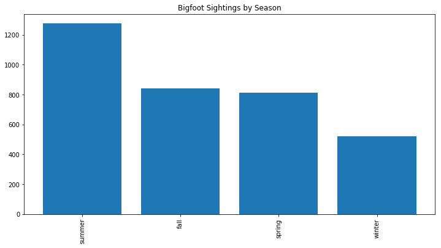

# Big Foot Sightings
## Unsupervised Learning Case Study

 
### Data

Bigfoot sighting reports were collected from the [Geographic Database of Bigfoot / Sasquatch Sightings & Reports](http://www.bfro.net/gdb/).

### Problem
* Get the data into a usable form
* Use unsupervised learning to discover useful information about Bigfoot sightings

### Web Scraping

```python
def get_content():
    reports = []
    with open('bigfoot_data.json') as f:
        for i in f:
            reports.append(json.loads(i))


    content_list = []
    data = pd.read_json('bigfoot_data.json', lines='true',orient='records')
    for i in range(len(reports)):
        soup = BeautifulSoup(reports[i]['html'], 'html.parser')

        tables = pd.read_html(data.iloc[i,1])
        content = tables[3][0][0]
        content = unidecode(content)
        content_list.append(content)
    return content_list
```

### Findings
What state has the most Bigfoot sightings?


What season is Bigfoot most often seen?


